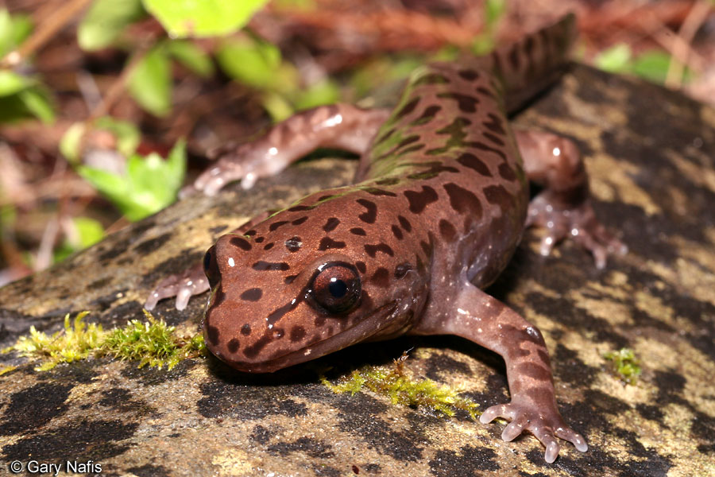
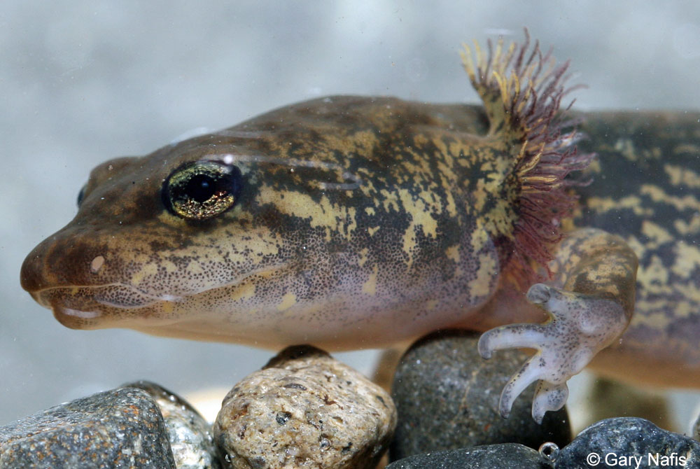
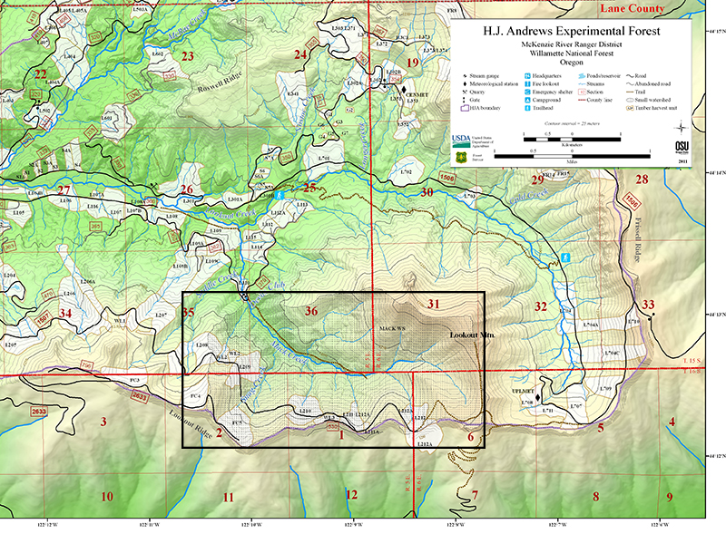

```{r setup, include=FALSE}
knitr::opts_chunk$set(echo = FALSE,
                      message = FALSE,
                      warning = FALSE)

# Attach packages 
library(tidyverse)
library(dplyr)
library(janitor)
library("RColorBrewer")
library(effsize)
library(kableExtra)
library(here)
library(ggbeeswarm)
library(car)
library(here)
```

<center>
{width=50%}{width=50%}
<br>
Adult (*left*) and Larval (*right*) Pacific Giant Salamander, (*Dicamptodon tenebrosus*) [*(Credit: Gary Nafis)*](http://www.californiaherps.com/salamanders/pages/d.tenebrosus.html)
</center>

### Introduction

The Pacific Giant Salamander (*Dicamptodon tenebrosus*), is the largest terrestrial salamander in North American. These large amphibians are endemic to the Pacific Northwests and can be found in coastal forests from Northern California to the southernmost extremes of British Columbia. Pacific Giant Salamanders live in or near cold, clear streams, as well as lakes and ponds, where they can hide under large stones, roots and logs (Oregon Wild, 2019). As an amphibian, Pacific Giant Salamanders depend on a clean aquatic environment and serve an an important indicator species for declining in water quality. Larval salamanders hatch underwater and are fully aquatic until they metamorphose into terrestrial adults. Metamorphosed adults are still typically found with 50 meters of streams and must reproduce in water (CaliforniaHerps, 2019). Human activities such as logging can impact salamander habitat by decreasing water quality and increasing water temperature. Clear cutting occured in a portion of the 500-year old growth forest surrounding Mack Creek in the Andrew Experimental Forest, Oregon in 1963. This report compares salamander data between the clear cut and old growth sections of the forest to determine if there has been a significant impact on salamander abundance, habitat usage and size as a result of the 1963 logging.
<br>
<br>

### Data and Methods

The Andrews Experimental Forest's Aquatic Vertebrate Population Study collected and provided sata for Pacific Giant Salamander abundance and size. Scientists monitored two 150m reaches of stream (clear cut and old- growth) along Mack Creek for Pacific Giant Salamanders annually. Each reach was divided into 3 50m sub-reaches with nets and sampled using two pass electrofishing. The numbers, size and location within the channel (cascade, pool, and side channel) were recorded annually for all captured salamanders from 1993 to 2017. All statistical analysis was done using R software 3.6.1. Means, standard deviation, variance and standard error were calculated for salamander weights based on forest condition and channel classification. A t-test was used to compare mean weights between old growth and clear cut forest sections and a comparison of salamander abundance by channel classification was done using a chi-squared analysis. A post-hoc one way ANOVA was used to analyze relationships between mean weight and channel classification. 

<center>

<br>
Map of H.J. Andrews Exerimental Forest. Location of Mack Creek indicated by black box. [*(Credit: HJ Andrews Experimental Forest LTER*](https://andrewsforest.oregonstate.edu/sites/default/files/lter/data/map/2017_andrews_basemap_geopdf.pdf)
</center>
<br>

### Results
```{r}
# Read in data form mack_creek_vertebrates.csv, clean names to lowercase snakecase

mack_creek_raw <- read_csv("mack_creek_vertebrates.csv") %>% 
  clean_names() 

# Filter data to only keep pacific giant salamander data 

salamander_raw <- mack_creek_raw %>% 
  filter(species == "DITE")
```
<br>

#### A: Salamander Abundance by Forest Condition (1993-2017)
<br>
<center>
```{r}

# Create data frame for annual lobster abundance (count) by forest condition (section).

salamander_count <- salamander_raw %>% 
  group_by(year) %>% 
  count(section) %>% 
  rename(count = n) %>% 
  mutate(section = case_when(
    section == "OG" ~ "Old Growth",
    section == "CC" ~ "Clear Cut"))

# Create line graph to visulize changes in salamander abundance by forest condition from 1993 - 2017

ggplot(salamander_count, aes(x = year, y = count)) +
  geom_line(aes(color = section)) +
  scale_color_manual(values = c("tan4", "green4")) +
  scale_x_continuous(limits=c(1993,2017), 
                     breaks=seq(1993,2017,3)) +
  scale_y_continuous(limits=c(0,450), 
                     breaks=seq(0,450,100)) +
  labs(x = "Year",
       y = "Pacific Giant Salamander Abundance\n (# of individuals)",
       title = "Abundance of Pacific Giant Salamander in Mack Creek\n (1993 - 2017)") +
  theme(panel.grid.minor = element_blank(),
          panel.background = element_blank(),
          axis.line = element_line(color = "black"),
          legend.position = c(0.2, 0.8), 
          legend.text = element_text(size = 12),
          legend.key = element_blank(),
          legend.title = element_blank(),
          plot.title = element_text(hjust = .5),
          plot.caption = element_text(hjust = .5))
```
<br>
**Fig 1.** *Pacific giant salamander population abundance in old growth (green) and clear cut (brown) sections of Mack Creek between 1993 and 2017.* Abundance increased in both sections between 1993 and 2017 and show similar trends in yearly abundance.
</center>
<br>
Salamander abundance in Mack Creek shows an overall increase from 1993 to 2017 with populations nearly tripling in both clear cut and old growth sections during this time period. Abundance in both old growth and clear cut sections of Mack Creek follow similar patterns in yearly variation and in both sections there was a significant increase in abundance in 2001. Old growth and clear cut sections of Mack Creek also saw a large decline in salamander abundance in 2011, with abundance in both sections declining to similar amounts (137 and 143 salamanders respectively) by 2014. While both sections show similar recovery in abundance by 2017, prior to the 2011 population decline, salamander abundance in old growth sections was consistently higher than in clear cut sections. When the populations began to recover in 2014, abundance increased faster in clear cut sections than in old growth.
<br>
<br>

#### B: 2017 Salamander Counts by Channel Classification and Forest Condition

<br>
**Table 1.** *2017 Abundance of Pacific Giant Salamanders in clear cut and old growth areas by location in channel (cascade, pool, side channel).* Proportional percentage is show in parenthesis.
<center>
<br>
```{r}

# Create data frame for 2017 lobster abundance (count) by channel classification pool, cascades and side-channel) for old growth and clear cut sections of Mack Creek.

salamander_count_class <- salamander_raw %>% 
  filter( year == 2017, unittype %in% c("C", "P", "SC")) %>% 
  count(unittype, section) %>% 
  rename(count = n) %>% 
  mutate(section = case_when(
    section == "OG" ~ "Old Growth",
    section == "CC" ~ "Clear Cut"),
    unittype = case_when(
    unittype == "C" ~ "Cascade",
    unittype == "P" ~ "Pool", 
    unittype == "SC" ~ "Side Channel"))

# Create contingency table

sal_class_table <- salamander_count_class %>% 
  pivot_wider(names_from = unittype, values_from = count)

# Calculate proportions 

sal_class_props <- sal_class_table %>% 
  adorn_percentages(denominator = "row") %>% 
  adorn_pct_formatting(digits = 1) %>% 
  adorn_ns(position = "front")

# Create table to visulize counts and proportions

kable(sal_class_props, col.names = c("", "Cascade", "Pool", "Side Channel")) %>% 
  add_header_above(c(" ", "Channel Classification" = 3)) %>% 
  kable_styling(bootstrap_options = "hover", 
                full_width = F,
                position = "center")
  
```
</center>
<br>
<br>

#### C: Association between Forest Condition and Salamander Location

```{r}

# Run chi sq test to test for independance between where in the channel salamanders are found and forest condition

chi_salamandar <- sal_class_table %>% 
  select(-section)

chi_sq_sal<- chisq.test(chi_salamandar)


```

There is no significant difference in where in the channel Pacific giant salamanders are located (pool, cascade or side channel) between old growth sections and clear cut sections of Mack Creek ($\chi$^2^(`r chi_sq_sal$parameter`) = `r round(chi_sq_sal$statistic, 2)`, *p* = `r round(chi_sq_sal$p.value, 2)`). Salamanders preferred cascades in both old growth forest (62.8%, n = 201) and clear cut forests (67.1%, n = 247). Pools and side channels had less overall abundance than cascades but salamanders counts were similar between old growth (Pool: 14.1%, n = 45, Side Channel: 23.1%, n = 74) and clear cut (Pool: 8.4%, n = 31, Side Channel: 24.5%, n = 90) for both pool and side channels. 
<br>
<br>

#### D: Forest Condition Effect on Mean Salamander Weight 

```{r}

# Create df of salamandar weight for old growth and clear cut sites for 2017

salamandar_weight <- salamander_raw %>% 
  select(year, section, weight) %>% 
  filter(year == "2017") %>% 
  group_by(section)

# Create vector of salamander weight for old growth 

sal_weight_og <- salamandar_weight %>% 
  filter(section == "OG") %>% 
  pull(weight)

# Create vector of salamander weight for old growth 

sal_weight_cc <- salamandar_weight %>% 
  filter(section == "CC") %>% 
  pull(weight)

# Run 2 sided T Test

ttest_forest_condition <- t.test(sal_weight_og, sal_weight_cc)

# Calculate Cohen d to determine effect size
d_forest_condition  <- cohen.d(sal_weight_og, sal_weight_cc, na.rm = TRUE)

# Create statistic for Comparison

mean_weight_og <- mean(sal_weight_og, na.rm = TRUE)
mean_weight_cc <- mean(sal_weight_cc)

# Calculate standard deviation

sd_weight_og <- sd(sal_weight_og, na.rm = TRUE)
sd_weight_cc <- sd(sal_weight_cc)

# Calculate Sample Sizes
n_og <- length(sal_weight_og)
n_cc <- length(sal_weight_cc)


```

In 2017, salamanders in old growth sections of Mack Creek had a mean weight (`r round(mean_weight_og, 2)` $\pm$ `r round(sd_weight_og, 2)`, n = `r n_og`) that did not differ significantly from the mean weight of salamanders in clear cut sections (`r round(mean_weight_cc, 2)` $\pm$ `r round(sd_weight_cc, 2)`, n = `r n_cc`) by a two-sided, two sample t-test (t(`r round(ttest_forest_condition$parameter, 2)`) = `r round(ttest_forest_condition$statistic, 2)`, *p* = `r round(ttest_forest_condition$p.value, 3)`). With a small effect size (Cohen's *d* = `r round(d_forest_condition$estimate, 2)`) the difference in mean salamander weight between old growth sections and clear cut sections of Mack Creek is not noticeable.
<br>
<br>

#### E. Channel Classification Effect on Mean Salamander Weight

<br>
<center>
```{r}
# Create df of salamandar weight by channel classification for 2017

sal_weight_class <- salamander_raw %>% 
  select(year, weight, unittype) %>% 
  filter(year == "2017", unittype %in% c("C", "P", "SC")) %>% 
    mutate(unittype = case_when(
    unittype == "C" ~ "Cascade",
    unittype == "P" ~ "Pool", 
    unittype == "SC" ~ "Side Channel")) %>% 
  group_by(unittype) 

# Create summary table 

sal_mean_class <- sal_weight_class %>% 
  summarise(mean_weight = mean(weight, na.rm = TRUE),
            sd = sd(weight, na.rm = TRUE),
            se = sd(weight, na.rm = TRUE) / sqrt(n()),
            var = var(weight, na.rm = TRUE),
            count = n())

# Create custom color palette for channel classification

site_palette <- c("#7AD7F0", "#00A6D7", "#0058B3")

# Create Beeswarm plot

ggplot(data = sal_mean_class,
       aes(x = unittype,
           y = mean_weight)) +
  geom_beeswarm(data = sal_weight_class,
                aes(x = unittype, y = weight,
                    color = unittype),
                show.legend = FALSE,
                alpha = .7,
                size = 1)+
  geom_errorbar(data = sal_mean_class,
                mapping = aes(ymin = mean_weight - sd,
                              ymax = mean_weight + sd),
                width = 0.1)+
  geom_point(data = sal_mean_class,
             aes(x = unittype,
                 y = mean_weight),
             color = "black") +
  scale_color_manual(values = site_palette) +
  scale_y_continuous(expand = c(0,0),
                     limits = c(-5, 87.5),
                     breaks = c(0, 25, 50, 75)) +
  labs(x = "Channel Classification",
       y = "Weight (g)",
       title = "Distribution of Pacific Salamander Weight\n by Channel Classification (2017)") +
  theme(panel.grid.minor = element_blank(),
          panel.background = element_blank(),
          axis.line = element_line(color = "black"), 
          plot.title = element_text(hjust = .5),
          plot.caption = element_text(hjust = .5))

```
<br>
**Fig. 2** *Weight distribution for Pacific giant salamanders pools, cascades and side-channels for 2017.* The black dot indicates the mean weight for each channel classification, cascades (n = `r round(sal_mean_class$mean_weight[1],2)`), pools (n = `r round(sal_mean_class$mean_weight[2],2)`), and side channels (n = `r round(sal_mean_class$mean_weight[3],2)`), and the bars show the standard error. Color indicates channel classification. 
</center>
<br>

```{r fig.show = 'hide'}

# Look at distributions (histogram and quantile plot) to visuily explore normaility 

ggplot(sal_weight_class, aes(x = weight)) +
  geom_histogram(aes(fill = unittype),
                 alpha = 0.5,
                 show.legend = FALSE,
                 bins = 15) +
  facet_wrap(~unittype, scales = "free")+
  scale_fill_manual(values = site_palette) +
  scale_color_manual(values = site_palette)


ggplot(sal_weight_class, aes(sample = weight)) +
  geom_qq(aes(color = unittype),
                 alpha = 0.5,
                 show.legend = FALSE) +
  facet_wrap(~unittype, scales = "free") +
  scale_color_manual(values = site_palette)

# Data is not normal but sample size is n < 30 and because we are taking a parameter (weight) and calculating the mean we can apply the central limit therom to assume the means are normally distributed

# Preform Levene's Test for equal variances

levene_class <- leveneTest(weight ~ unittype, sal_weight_class)

# No siginfigant difference in varience across class classification

# Preform a 1 Way ANOVA to test for siginfigant differences in mean weight across channel classification

sal_class_aov <- aov(weight ~ unittype, sal_weight_class)


# The one way anova shows a signifigant difference between the means of one or more channel classifications. 

# Preform post-hoc pairwise testing to compare each pair of means

tukey_sal_class <- TukeyHSD(sal_class_aov)

aov_outputs <- unlist(summary(sal_class_aov))
```

The mean weight of Pacific Giant Salamanders differs significantly between pools (*$\mu$* = `r round(sal_mean_class$mean_weight[2],2)`g, $\pm$ `r round(sal_mean_class$sd[2], 2)`) and side channels (*$\mu$* = `r round(sal_mean_class$mean_weight[3], 2)`g, $\pm$ `r round(sal_mean_class$sd[3], 2)`) (one-way ANOVA with post-hoc Tukey's HSD, F(`r aov_outputs[1]`, `r aov_outputs[2]`) = `r round(aov_outputs[7],2)`, *p* = `r round(aov_outputs[9],3)`). There was no significant difference between the mean weight of salamanders found in cascades (*$\mu$* = `r round(sal_mean_class$mean_weight[1],2)`g, $\pm$ `r round(sal_mean_class$sd[1], 2)`) compared to pools or side channels.

A post hoc one way ANOVA may not be the best way to analyze difference in weight for salamanders based on channel classification. Multiple large outliers in weight observations found in all three channel classifications (Fig. 2) positively skew the mean weight for all three groups. Because the means in each group are positively skewed a rank based test to compare the median weight of each group may be a more accurate assement of variation in weight between channel classification. 
<br>
<br>

### Summary

- Salamander abundance has increased in both old growth and clear cut sections of Mack Creek between 1993 and 2017 (Fig 1). Old growth sections have slightly higher salamander abundance than clear cut sections until 2011, when populations in both sections decline. Salamander abundance in clear cut sections appears to recover faster than in old growth sections after this decline.
- Forest condition (clear cut verse old growth) does not significantly influence where salamanders are located within the stream channel (Table 1). In both clear cut and old growth, cascades have the highest salamander abundance and proportions of salamanders in all three locations are similar across both forest condition. The clear cutting that occured in 1993 does not appear to have impacted salamander in-stream habitat preferance.  
- The salamander abundance findings indicate that Pacific Giant Salamanders may be able to successfully recover from changes in forest condition after logging practices cease. 
- The only significant difference in average weight was found between salamanders in pools and side channels, with salamanders in side channels having a slightly lower mean weight (Fig 2). There was no significant difference in mean weight between salamanders in cascades when compared to the other two channel locations. 
<br>
<br>

### References:

Gregory S. V. 2016. Aquatic Vertebrate Population Study in Mack Creek, Andrews Experimental Forest, 1987 to present. Environmental Data Initiative. https://doi.org/10.6073/pasta/5de64af9c11579266ef20da2ff32f702. Dataset accessed 12/02/2019.

Pacific Giant Salamander. Oregon Wild, 2019. (https://oregonwild.org/wildlife/pacific-giant-salamander) Retrieved 12/02/2019

Coastal Giant Salamander - Dicamptodon tenebrosus. CaliforniaHerps. (http://www.californiaherps.com/salamanders/pages/d.tenebrosus.html) Retrieved 12/02/2019

Maps. Andrews Experimental Forest, 2017. (http://andlter.forestry.oregonstate.edu/data/place.aspx?domain=place&dbcode=HF004&placeid=669) Retrieved 12/02/2019

